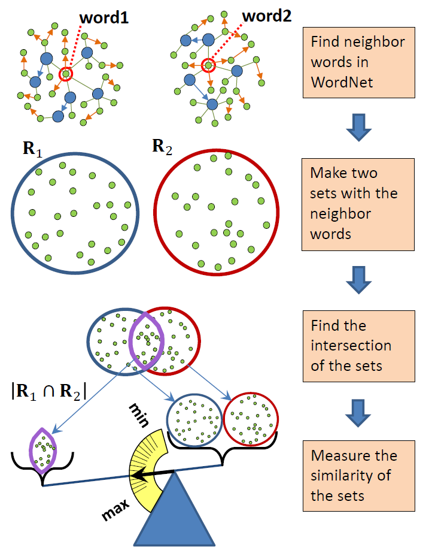

# word2set: Neighboring words in WordNet
Tool to find semantically related neighboring words in WordNet.



## Examples
List the neighboring related words in WordNnet for a word

```
>>> import neighboring_words as nw
>>>
>>> print(sorted(nw.neighbors("cognizance")))
['apprehension', 'aware', 'awareness', 'certain', 'clear', 'cognisance', 'cognisant', 'cognise', 'cognizance', 'cognizant', 'cognize', 'conscious', 'consciousness', 'feel', 'followed', 'gained', 'general', 'incognizance', 'incognizant', 'individuality', 'intuitive', 'ken', 'know', 'knowing', 'knowingness', 'knowledge', 'mental', 'often', 'perceived', 'perceiving', 'perception', 'range', 'realization', 'scope', 'self-aware', 'self-awareness', 'sense', 'sensify', 'showing', 'sometimes', 'unaware', 'unawareness', 'understand', 'understanding']
>>>
>>> print(sorted(nw.neighbors("incubate")))
['animal', 'arise', 'breed', 'brood', 'brooder', 'conditions', 'conducive', 'copulate', 'cover', 'develop', 'development', 'differentiation', 'eggs', 'emerge', 'environment', 'evolution', 'evolve', 'female', 'given', 'grow', 'growth', 'hatch', 'horses', 'incubate', 'incubation', 'incubator', 'individuals', 'multiplication', 'multiply', 'natural', 'offspring', 'plant', 'process', 'procreate', 'procreation', 'procreative', 'produce', 'progress', 'promote', 'reproduce', 'reproduction', 'reproductive', 'seat', 'sit', 'sit_down', 'take', 'unfold']
>>>
>>> print(sorted(nw.neighbors("subdivide")))
['apart', 'carve_up', 'come', 'dissever', 'divide', 'divider', 'divisible', 'division', 'part', 'partitive', 'parts', 'pieces', 'portions', 'separate', 'smaller', 'split', 'split_up', 'subdivide', 'subdivision', 'subdivisions', 'unite']
>>>
>>> print(sorted(nw.neighbors("wealthy")))
['abundant', 'affluence', 'affluent', 'flush', 'loaded', 'material', 'money', 'moneyed', 'poor', 'possessing', 'possessions', 'rich', 'richness', 'supply', 'value', 'wealth', 'wealthiness', 'wealthy']
```
## Lexical Similarity

Determine the similarity of a pair or words:
```
>>> import neighboring_words as nw
>>
>>> nw.COSINE("car","driver")
0.1046336064242884
>>>
>>> nw.COSINE("house","driver")
0.0289390563534866
>>>
>>> nw.COSINE("car","train")
0.1655928164071086
>>>
>>> nw.COSINE("domain","knowledge")
0.11983723142404717
>>>
>>> nw.COSINE("domain","pain")
0.022627445961118885
```

